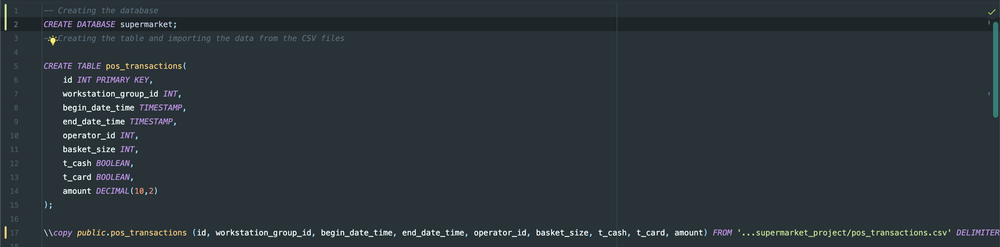
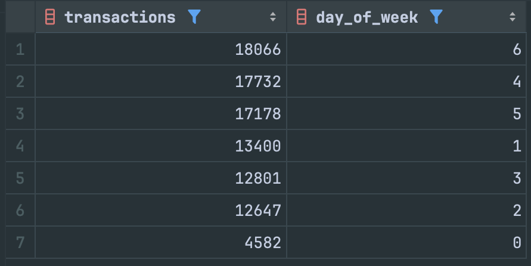
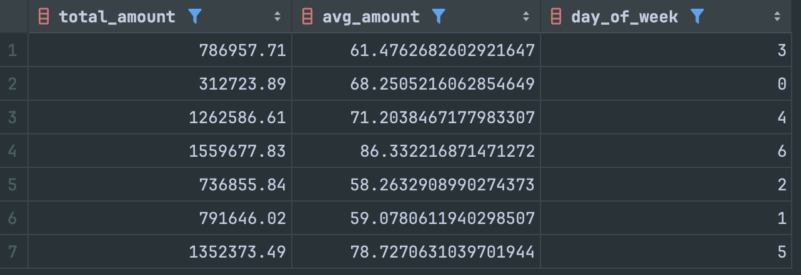

# Supermarket Transaction Analysis in PostgreSQL

In this case study, I analyze transaction data from a Polish supermarket. The dataset contains tens of thousands of transactions, each recording the date and time, basket size, amount, and other relevant details. I will attempt to answer several financial questions such as:
1. Do people make more transactions with cash or card?
2. Which day of the week has the most transactions in 2019?
3. What is the total revenue per week in 2019?

### Data Preparation

Before diving into the analysis, I created a brand new database in PostgreSQL, created a table with the appropriate data types and imported the data from a csv file.


### Methodology

For the analysis, I used SQL to query the dataset and extract the necessary information. The queries were designed to answer the financial questions posed above, and the results were visualized using various charts and graphs.

### Questions of Interest
**Which day of the week has the most transactions in 2019?**
```SQL
SELECT
    COUNT(*) AS transactions,
    EXTRACT(DOW FROM begin_date_time) AS day_of_week
FROM pos_transactions
WHERE EXTRACT(YEAR FROM begin_date_time) = 2019
GROUP BY day_of_week
ORDER BY transactions DESC;
```


Saturday (6) has the most weekly transactions, while Sunday (0) has the least. That is because, in Poland, the law states that no shopping can occur on two Sundays each month, leading to more people buying on Saturdays instead. 

**What is the total and average amount spent per day of the week in 2019**
```SQL
SELECT
    SUM(amount) AS total_amount,
    AVG(amount) AS avg_amount,
    EXTRACT(DOW FROM begin_date_time) AS day_of_week
FROM pos_transactions
WHERE EXTRACT(YEAR FROM begin_date_time) = 2019
GROUP BY day_of_week;
```


While Sunday has the least total amount of transactions and the least total amount spent, the average amount spent on Sundays is roughly in the middle of the set. Monday, Tuesday, and Wednesday have lower average amounts spent. Sunday is both the highest in total and average spent.  

### Conclusion

The analysis provided valuable insights into transaction patterns at the supermarket. These insights can assist the supermarket in making data-driven decisions to enhance operations and boost revenue.

View my dedicated SQL file here: [supermarket_analysis.sql](supermarket_analysis.sql)